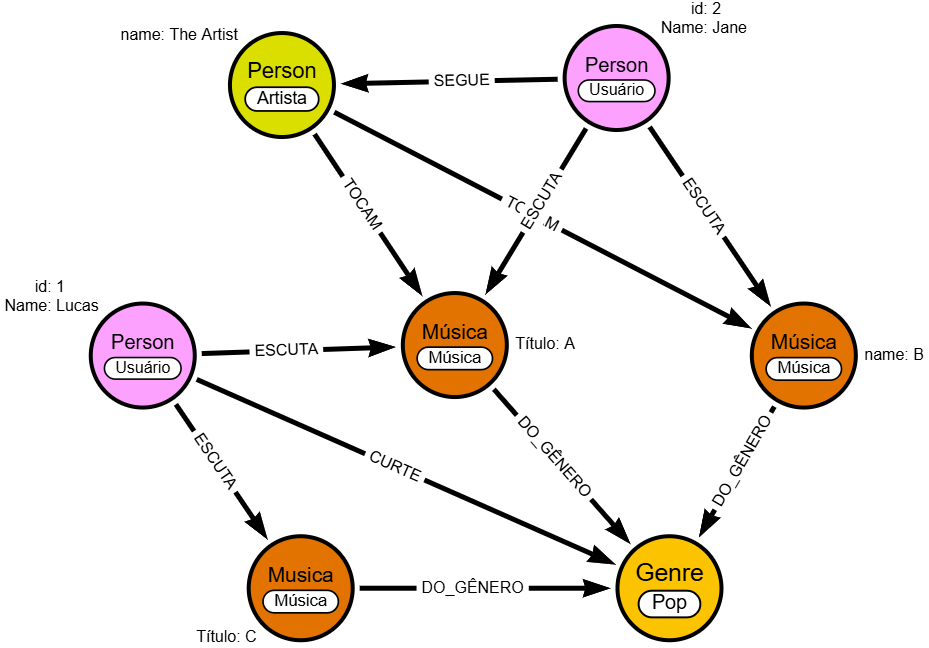
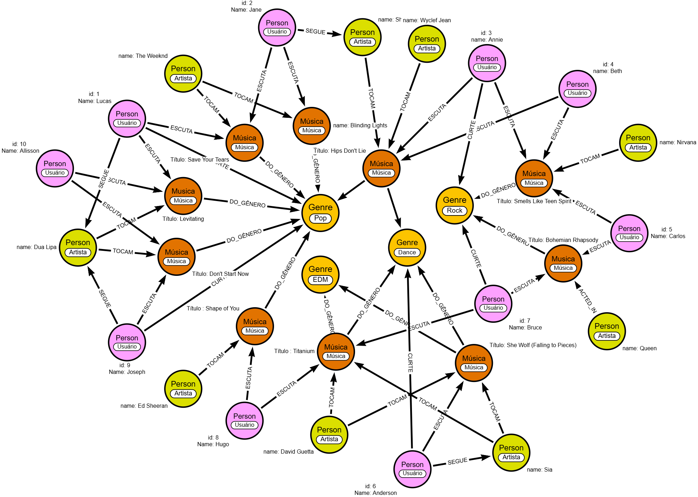

# Algoritmo-de-Recomendacao-de-Musicas
##Descrição:

Figura1. Modelo


Figura2. Exemplo

</> Markdown
## Exemplo de Query
```cypher
MATCH (u:Person {name: "Lucas", tipo: "Usuário"})

// Músicas já consumidas
OPTIONAL MATCH (u)-[:ESCUTA|CURTE]->(m1:Musica)

// Artistas dessas músicas
OPTIONAL MATCH (m1)-[:TOCAM]->(a1:Person {tipo: "Artista"})

// Gêneros dessas músicas
OPTIONAL MATCH (m1)-[:DO_GENERO]->(g:Genre)

// Artistas que o usuário segue
OPTIONAL MATCH (u)-[:SEGUE]->(a2:Person {tipo: "Artista"})

// Candidatas à recomendação
MATCH (rec:Musica)

// Ligações possíveis
OPTIONAL MATCH (rec)-[:TOCAM]->(aRec:Person {tipo: "Artista"})
OPTIONAL MATCH (rec)-[:DO_GENERO]->(gRec:Genre)

// Regras de pontuação
WITH u, rec,
     COUNT(DISTINCT CASE WHEN gRec = g THEN 1 END) AS genreScore,
     COUNT(DISTINCT CASE WHEN aRec = a1 THEN 1 END) AS artistScore,
     COUNT(DISTINCT CASE WHEN aRec = a2 THEN 1 END) AS followScore

// Remove músicas já ouvidas
WHERE NOT (u)-[:ESCUTA|CURTE]->(rec)

// Score final ponderado
WITH rec,
     (genreScore * 1) +
     (artistScore * 2) +
     (followScore * 3) AS score


RETURN rec.titulo AS musica, score
ORDER BY score DESC
LIMIT 5
```


#Setup

#Data Import

#Feedback
